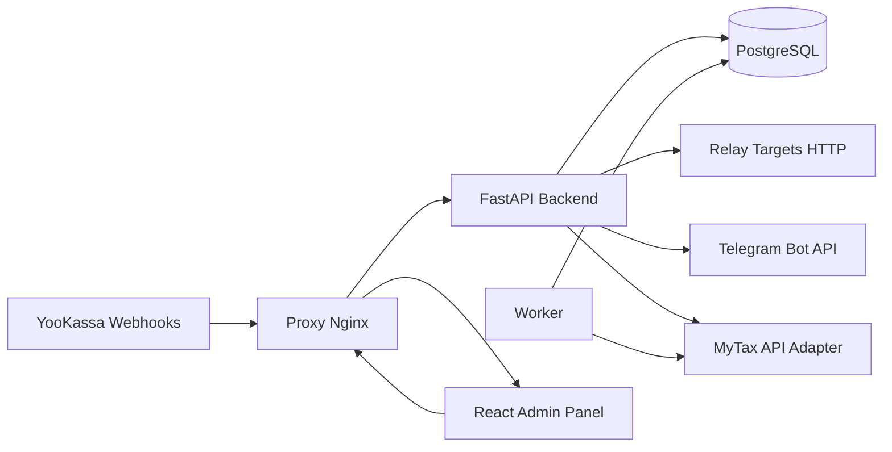
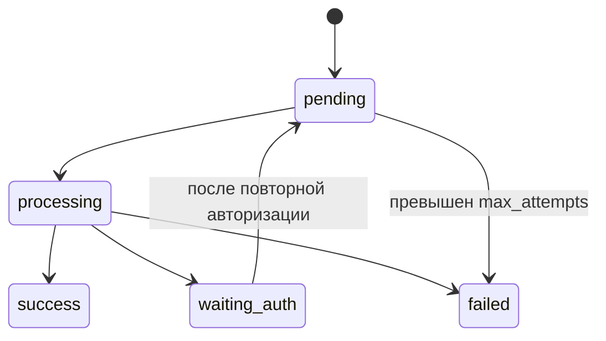

# YooKassa → Мой Налог Auto Relay


Open-source система для самозанятых: принимает webhook-уведомления YooKassa, формирует/отзывает чеки в «Мой Налог», ретранслирует уведомления в сторонние URL, ведёт очередь задач, логи, статистику и Telegram-оповещения.

---

## Почему этот проект появился

YooKassa убрала встроенную автоматическую отправку чеков в «Мой Налог». Этот проект закрывает образовавшийся разрыв:

- получает события `payment.*` / `refund.*` от YooKassa;
- конвертирует их в задачи формирования/отмены чеков;
- при проблемах авторизации «Мой Налог» не теряет данные, а ставит задачи в очередь `WAITING_AUTH`;
- после восстановления доступа автоматически дообрабатывает накопленные задачи.

Webhook документация YooKassa: https://yookassa.ru/developers/using-api/webhooks

---

## Что реализовано

- Мульти-магазин: несколько магазинов на одном домене через разные пути (`/webhook/{store_path}`)
- CRUD настроек через веб-интерфейс
- Гибрид «Мой Налог»:
	- `official_api` режим
	- `unofficial_api` режим (token/cookie-based)
- Очередь чеков с retry-логикой и статусами
- Авто-отмена чека при возврате (`refund.succeeded` / `payment.canceled`)
- Ретрансляция webhook в сторонние endpoint’ы:
	- `fire_and_forget`
	- `retry_until_200`
	- опциональное добавление поля `generated_receipt_url`
- Telegram-уведомления:
	- поддержка обычных чатов/групп
	- поддержка `message_thread_id` (topics)
	- выбор событий для отправки
- Статистика и аналитика:
	- фильтры по магазину и дате
	- события, очередь, чеки, логи

---

## Архитектура





---

## Структура проекта

```text
Backend/
	app/
		core/          # config + db
		routers/       # API endpoints
		services/      # mytax/relay/telegram/template/worker
		models.py      # SQLAlchemy models
		schemas.py     # Pydantic schemas
		main.py        # FastAPI entrypoint
		worker_entry.py
Frontend/
	src/
		App.jsx        # web admin panel
docker-compose.yml
deploy/nginx/conf.d/default.conf
.env.example
```

---

## Быстрый старт (Docker Compose)

### 1) Подготовка

```bash
cp .env.example .env
```

Отредактируйте `.env`:

```env
POSTGRES_DB=yookassa_auto
POSTGRES_USER=postgres
POSTGRES_PASSWORD=strong-password
APP_ENV=production
APP_DEBUG=false
WORKER_POLL_INTERVAL_SECONDS=5
PROXY_BASE_URL=https://your-domain.tld
RUN_EMBEDDED_WORKER=false
```

### 2) Запуск

```bash
docker compose up -d --build
```

### 3) Доступ

- UI: `http://<server-ip>/`
- API health: `http://<server-ip>/api/health`

---

## Домен и TLS

Проект уже готов к доменному сценарию:

- контейнер `proxy` публикует `80` и `443`;
- пользователь привязывает DNS домен к IP сервера;
- SSL можно выпускать внешним способом (например, certbot) и монтировать сертификаты в `deploy/nginx/certs`.

Webhook URL для YooKassa:

```text
https://your-domain.tld/webhook/<store_path>
```

---

## Настройка в веб-панели

### 1) Мой Налог profile

Создайте профиль и выберите режим:

- `official_api`: через внешний официальный интеграционный endpoint
- `unofficial_api`: через `access_token` и/или `cookie_blob`

Если доступ протухнет, задачи автоматически переходят в `WAITING_AUTH` и не теряются.

Дополнительно доступно в панели:

- проверка действительности текущей сессии (`auth check`) через API `lknpd`;
- вход по телефону в 2 шага: `SMS challenge` → подтверждение кода;
- редактирование и удаление профилей;
- расширенные auth-логи в отдельной вкладке `Логи` (включая `context`).

### 2) Магазин

Для магазина задаются:

- `webhook_path`
- шаблон описания (`description_template`)
- JSON path полей (`amount_path`, `payment_id_path`, `customer_name_path`)
- режим ретрансляции (`relay_mode`)
- `include_receipt_url_in_relay`
- `auto_cancel_on_refund`

### 3) Ретрансляция

Можно добавить один или несколько target URL для каждого магазина.

Режимы:

- `fire_and_forget`: отправить и не ждать 200
- `retry_until_200`: повторять до `relay_retry_limit`

Опционально в relayed JSON добавляется поле:

```json
{
	"generated_receipt_url": "https://..."
}
```

### 4) Telegram

Для каждого магазина можно назначить свои каналы и события:

- `payment_received`
- `refund_received`
- `receipt_created`
- `receipt_canceled`
- `mytax_auth_required`

Поддержка тем (topics): заполните `topic_id`.

---

## Шаблоны и переменные

Поддерживаются шаблоны вида `{{variable}}`.

Базовые переменные:

- `{{payment_id}}`
- `{{amount}}`
- `{{customer_name}}`
- `{{event}}`
- доступ к payload: `{{payload.object.id}}`

Пример:

```text
Оплата заказа {{payment_id}} на сумму {{amount}} ₽
```

---

## Примеры webhook payload

### Платёж

```json
{
	"event": "payment.succeeded",
	"object": {
		"id": "2b7f-0001",
		"amount": { "value": "1990.00", "currency": "RUB" },
		"metadata": { "customer_name": "Иван" }
	}
}
```

### Возврат

```json
{
	"event": "refund.succeeded",
	"object": {
		"id": "2b7f-0001",
		"amount": { "value": "1990.00", "currency": "RUB" }
	}
}
```

---

## Аналитика и аудит

Панель содержит вкладки:

- `Обзор` (агрегированные метрики)
- `События`
- `Очередь`
- `Чеки`
- `Логи`

Фильтры:

- по магазину
- по диапазону дат

---

## API (основные endpoint’ы)

- `GET /api/health`
- `GET/POST/PUT/DELETE /api/stores`
- `GET/POST/PUT /api/profiles`
- `DELETE /api/profiles/{id}`
- `POST /api/profiles/{id}/login`
- `POST /api/profiles/{id}/auth/check`
- `POST /api/profiles/{id}/auth/phone/start`
- `POST /api/profiles/{id}/auth/phone/verify`
- `GET/POST /api/relay-targets`
- `GET/POST /api/telegram-channels`
- `POST /api/webhook/{store_path}`
- `GET /api/events`
- `GET /api/queue`
- `POST /api/queue/retry`
- `GET /api/receipts`
- `GET /api/logs`
- `GET /api/stats`

---

## Что проверено по интеграциям «Мой Налог»

Проверены открытые проекты:

- https://github.com/loolzaaa/mytax-client
- https://github.com/shoman4eg/moy-nalog
- https://github.com/byBenPuls/moy_nalog
- https://github.com/TimNekk/nalog

Вывод: в open-source чаще встречается неофициальная интеграция через auth/token/cookie и endpoint’ы `lknpd.nalog.ru`. Поэтому в системе реализован гибридный подход + обязательная очередь при auth-проблемах.

---

## Ограничения текущей версии

- `official_api` зависит от внешнего интеграционного endpoint (`PROXY_BASE_URL/mytax/...`).
- неофициальный API может меняться со стороны сервиса; при изменениях может потребоваться адаптация endpoint’ов.

---

## Безопасность

- не храните открытые токены в git
- используйте секреты/`env` на сервере
- ограничьте доступ к панели reverse-proxy правилами (IP allowlist, basic auth, VPN)
- при необходимости включите проверку IP источника webhook

---

## Лицензия

MIT. См. [LICENSE](LICENSE).
