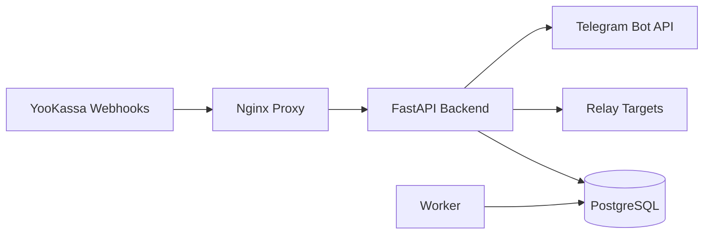

# YooKassa → Мой Налог Auto Relay


Open-source система для самозанятых: получает webhook YooKassa, формирует/отзывает чеки в «Мой Налог», ретранслирует события во внешние endpoint’ы и отправляет Telegram-уведомления.

## Быстрый старт (2 команды)

Windows PowerShell:

```powershell
Copy-Item .env.example .env
./scripts/up.ps1
```

Linux/macOS:

```bash
cp .env.example .env
chmod +x scripts/up.sh
./scripts/up.sh
```

## Важно по безопасности

- Панель заблокирована, пока не заданы `PANEL_LOGIN` и `PANEL_PASSWORD`.
- Для HTTPS включайте `PANEL_AUTH_COOKIE_SECURE=true`.
- Для anti-fraud используйте единый флаг `WEBHOOK_ANTIFRAUD_ENABLED=true`.

## Документация

- [Установка на Windows](docs/INSTALL_WINDOWS.md)
- [Установка на Linux](docs/INSTALL_LINUX.md)
- [Настройка SSL/TLS](docs/SSL_SETUP.md)
- [Переменные окружения](docs/ENVIRONMENT.md)
- [Эксплуатация: backup/update/restore](docs/OPERATIONS.md)
- [Скрипты автоматизации](docs/SCRIPTS.md)

## Архитектура


```mermaid
flowchart LR
    A[YooKassa Webhooks] --> B[Nginx Proxy]
    B --> C[FastAPI Backend]
    C --> D[(PostgreSQL)]
    C --> E[Relay Targets]
    C --> F[Telegram Bot API]
    H[Worker] --> D
```

## Лицензия

MIT, см. [LICENSE](LICENSE).
